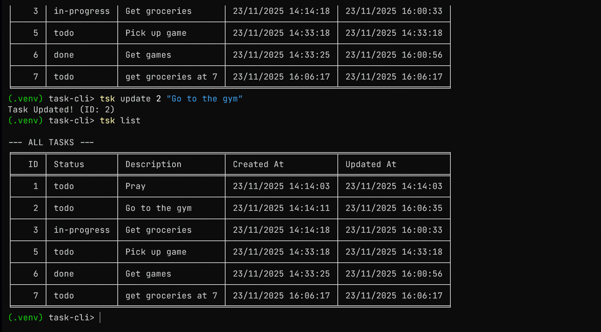

[](https://roadmap.sh/projects/task-tracker)
# 🚀 Task CLI: Command Line Task Management


**Task CLI** is a simple, lightweight, and cross-platform command-line interface tool for managing your daily to-dos right from your terminal. Stop switching apps—track, update, and organize your tasks with simple commands\!


-----

## 🛠️ Installation

Because Task CLI is packaged using `setuptools`, installation is a breeze 😉 using `pip`. This guide covers platform differences (e.g., using `python3` vs. `python` on Linux).

### 1\. Prerequisites (Linux Only)

If you are on a **Linux** distribution like Ubuntu, you may need to install the virtual environment tool and ensure you have `pip` available globally.

```bash
# This command installs the necessary system tools for Python 3
sudo apt update
sudo apt install python3 python3-pip python3-venv
```

### 2\. Clone the Repository

```bash
git clone https://github.com/JideMartins/task-cli.git
cd task-cli
```

### 3\. Activate Virtual Environment (Crucial Step‼️) 

This step **must** be performed every time you open a new terminal session to run the `tsk` command. The command you use depends on your OS:

```bash


# 1. Create the environment (Use the command that works on your system)
python3 -m venv .venv  # 🐧 Recommended for Linux/macOS
python -m venv .venv   # 🪟 Recommended for Windows

# 2. Run the activation script based on your OS/Shell:
source .venv/bin/activate      # 🐧 For macOS and Linux Shells (Bash/Zsh)
.\.venv\Scripts\Activate.ps1   # 🪟 For Windows PowerShell
.\.venv\Scripts\activate       # 🪟 For Windows Command Prompt (cmd)

```

> **Note on Python Command:** If `python` gives a "command not found" error, use **`python3`** instead.

### 4\. Install Dependencies & Application

Task CLI requires the `tabulate` library for visualization, which we install before the application itself.

```bash
# Install tabulate (for visual tables)
pip install tabulate

# Install the application locally. This makes the 'tsk' command available.
pip install .
```

### 5\. Verify Installation

After installation, immediately test the command.

```bash
tsk --help
```

  * **Expected Result:** The help documentation for the Task CLI is displayed.
  * **If you get an error like 'tsk' is not recognized:** This means you missed the **Activation Step (Step 3)**. Please ensure your prompt starts with `(.venv)`.

-----

## 🆘 Troubleshooting Quick Fixes

| Error Encountered | Cause | Solution |
| :--- | :--- | :--- |
| **`python` command not found** | Linux uses `python3` as the main command, not `python`. | Use **`python3`** instead of `python`. |
| **`ensurepip is not available... install python3-venv`** | The core `venv` module requires an additional system package on Ubuntu/Debian. | Run: `sudo apt install python3-venv` |
| **`E: Could not open lock file... Permission denied`** | `apt install` requires root (administrator) privileges. | Use **`sudo`** before the `apt install` command. |
---------------------


## 💡 Quick Start & Usage

Once installed, you can run the main command `tsk` followed by any subcommand.

### Core Commands

| Command | Description | Example |
| :--- | :--- | :--- |
| `tsk add` | Creates a new task. | `tsk add "Call the dentist"` |
| `tsk list` | Displays all tasks in a formatted table. | `tsk list` |
| `tsk update` | Modifies the description of an existing task. | `tsk update 5 "Call dentist at 2 PM"` |
| `tsk mark` | Changes the status of a task to `done` or `in-progress`. | `tsk mark -d 5` |
| `tsk delete` | Permanently removes a task. | `tsk delete 5` |

-----

## 📚 Detailed Command Reference

### 1\. Adding a Task (`tsk add`)

Adds a new task. It is automatically assigned the next available ID and given the status `todo`.

```bash
tsk add "Prepare the README documentation"
```

### 2\. Listing Tasks (`tsk list`)

Displays all tasks by default, using a clean table powered by the `tabulate` module.

| Option | Description | Example |
| :--- | :--- | :--- |
| **No Filter** | Lists all tasks. | `tsk list` |
| **Status Filter** | Filters tasks by a specific status. | `tsk list done` |

**Available Status Filters:** `todo`, `done`, `in-progress`

### 3\. Updating a Task (`tsk update`)

Requires the Task **ID** and the **new description**.

```bash
tsk update 10 "Refactor file_utils into storage module"
```

### 4\. Marking Status (`tsk mark`)

Uses mutually exclusive flags to change the task status.

| Flag | Status | Example |
| :--- | :--- | :--- |
| `-d`, `--done` | Marks task as `done`. | `tsk mark -d 10` |
| `-i`, `--inprog` | Marks task as `in-progress`. | `tsk mark -i 10` |

### 5\. Deleting a Task (`tsk delete`)

Permanently removes a task using its **ID**.

```bash
tsk delete 10
```

-----

## 💻 Project Structure

The Task CLI is organized into three distinct layers for maintainability and clarity:

- **`cli.py`**: Handles command-line argument parsing using `argparse` and acts as the entry point (`tsk = cli:main`).
- **`task_manager.py`**: Contains the core **business logic** (add, update, delete, set status).
- **`file_utils.py`**: Manages data **persistence** (loading and dumping the `tasks.json` file).
- **`table.py`**: Handles the clean, formatted display of tasks using the `tabulate` library.


-----

## 🆘 Getting Help



The Task CLI application uses Python's `argparse` module, which includes robust, built-in help documentation accessible directly from the command line.

### 1\. General Help

To see a list of all available subcommands and a brief description of the tool, run the main command with the standard help flag:

```bash
tsk --help    # or tsk -h
```

### 2\. Subcommand Specific Help

To view the required arguments, flags, and options for any specific command (like `add`, `update`, or `mark`), run the subcommand followed by the help flag. This is essential for commands that use arguments like `ID` or status flags.

| Command | Action |
| :--- | :--- |
| **Add Help** | Displays the required `description` argument. |
| **Mark Help** | Displays the mutually exclusive flags (`-d` / `-i`) and the required `ID`. |
| **List Help** | Displays the optional `status` filter argument and available choices. |

```bash
# Example 1: Getting help for the 'mark' command
tsk mark --help
```

```bash
# Example 2: Getting help for the 'list' command
tsk list -h
```

-----

### 📝 Example Output for `tsk mark --help`

If a user runs the command above, they will see output similar to this:

```
usage: tsk mark [-h] [-d | -i] id

Mark task as 'done' or 'in-progress' Usage:-d, --done or -i, --inprog

positional arguments:
  id                    Task ID

options:
  -h, --help            show this help message and exit

mutually exclusive arguments:
  -d, --done            Marks task as done
  -i, --inprog          Marks task as in-progress
```

---

## 🛡️ Error Handling Overview

The Task CLI is built with layered error handling to prevent data loss and application crashes. It ensures that the application either completes successfully or fails gracefully with a clear message.

| Area of Failure | Handled By | How It's Managed |
| :--- | :--- | :--- |
| **Invalid Task ID** | `task_manager.py` | Before any modification (update, delete, mark), the code checks if the `ID` exists. If not, it prints an error message, but crucially, it **returns the original, unchanged data**. This prevents overwriting the file with bad data. |
| **JSON Corruption** | `file_utils.py` (during loading) | Uses `try...except json.JSONDecodeError`. If your `tasks.json` file is manually corrupted (e.g., missing a comma), the application **halts execution** with a clear, fatal error message instructing the user to fix or delete the file. |
| **File Access Issues** | `file_utils.py` (during loading) | Uses `try...except OSError`. The app handles permission errors or file system issues by printing the specific error details and **exiting gracefully**. |
| **Missing File** | `file_utils.py` (during loading) | If `tasks.json` does not exist, the application automatically **creates it** and initializes it with an empty task object (`{}`). |


---

## 🛑 Troubleshooting & Error Handling


The Task CLI application is designed to handle common issues gracefully, but if you run into problems, check these solutions:

### 1. Command Not Found (`tsk` not recognized)

This error occurs when your terminal cannot locate the `tsk` executable.

* **Error Message (Windows):** `'tsk' is not recognized as the name of a cmdlet...`
* **Error Message (Linux/Mac):** `tsk: command not found`

**Solution:** You have not activated your virtual environment. You must run the activation script every time you open a new terminal session where you intend to use `tsk`.

| OS/Shell | Activation Command |
| :--- | :--- |
| **macOS/Linux** | `source .venv/bin/activate` |
| **Windows PowerShell** | `.\.venv\Scripts\Activate.ps1` |
| **Windows cmd** | `.\.venv\Scripts\activate` |

### 2. Task ID Not Found

This happens when you try to update, mark, or delete a task using an ID that does not exist in your current task list.

* **Error Output:** `Error: Task with ID '99' not found`

**Solution:** Always run `tsk list` first to confirm the correct ID of the task you want to modify. The system will safely ignore the command and **not** overwrite your `tasks.json` file.

### 3. Data Corruption (JSON Decode Error)

If you manually edit the `tasks.json` file and introduce a typo (like missing a comma or quote), the application will fail on startup.

* **Error Output:** `FATAL ERROR: The tasks.json file is corrupted or improperly formatted.`

**Solution:**
1.  **Inspect `tasks.json`:** Open the file and look for obvious syntax errors (check that every task dictionary is separated by a comma).
2.  **Start Fresh:** If you cannot find the error, **delete the `tasks.json` file**. The application will automatically recreate a fresh, empty file the next time you run a command like `tsk add ...`.